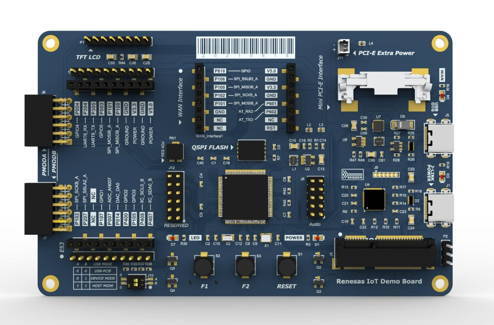

# 瑞萨CPKIOT-RA6M5开发板常用例程

## Overview
- **IDE:** e2studio 2025.04.1  FSP 5.8.0
- **芯片:** R7FA6M5BH3CFP 
- **开发板:** CPKIOT-RA6M5 

## Contact Information
&emsp;&emsp;[Official Link](https://www.renesas.com/en/products/microcontrollers-microprocessors/ra-cortex-m-mcus/cpkiot-ra6m5-cloud-connectivity-evaluation-board)

&emsp;&emsp;QQ group：1002486369
## Purchase Link

&emsp;&emsp;[Purchase Link](https://item.taobao.com/item.htm?abbucket=1&detail_redpacket_pop=true&id=895087411241&ltk2=1748694968977u3bg6abozr7s9f7sk0oy&ns=1&priceTId=215043fd17486949598281722e8000&query=RA6M5&spm=a21n57.1.hoverItem.1&utparam=%7B%22aplus_abtest%22%3A%22ef802cbda3f1d101c232241137c806de%22%7D&xxc=taobaoSearch)

## Datasheet
&emsp;&emsp;[CPKIOT-RA6Mx开发手册.pdf](/figures/CPKIOT-RA6Mx.pdf)

&emsp;&emsp;[CPKIoT_RA6Mx_RevA03_Schematic.pdf](/figures/CPKIoT_RA6Mx_RevA03_Schematic.pdf)
