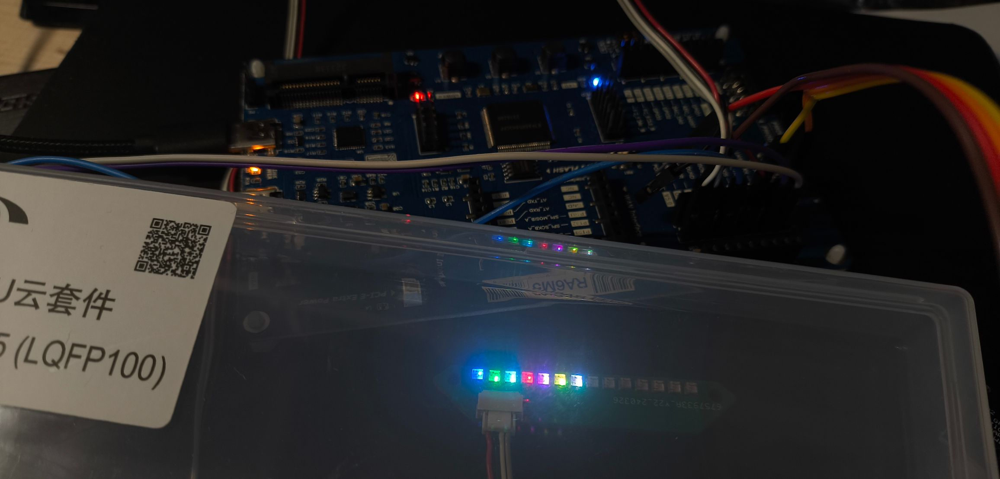
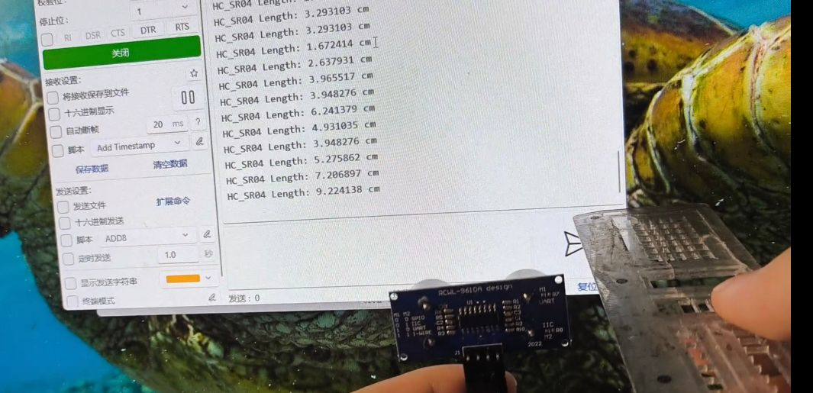
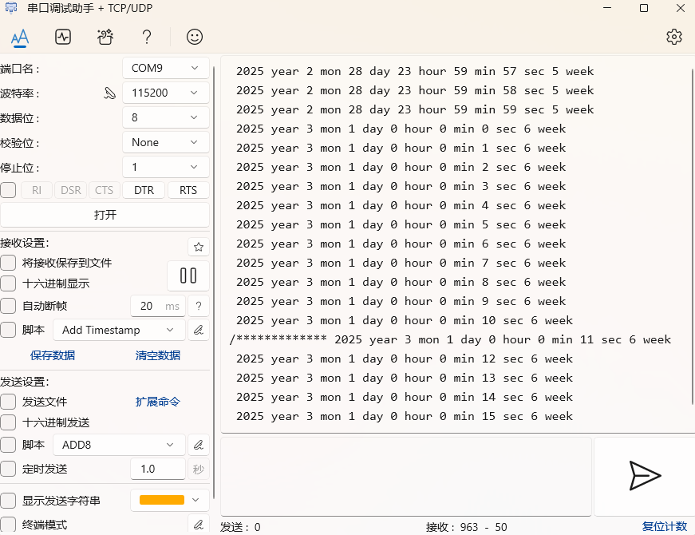
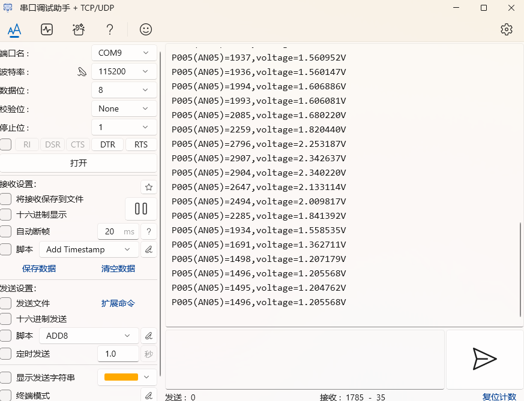

# 瑞萨CPKIOT-RA6M5开发板常用例程

## Overview
- **IDE:** e2studio 2025.04.1  FSP 5.8.0
- **芯片:** R7FA6M5BH3CFP 
- **开发板:** CPKIOT-RA6M5 

## Contact Information
&emsp;&emsp;[Official Link](https://www.renesas.com/en/products/microcontrollers-microprocessors/ra-cortex-m-mcus/cpkiot-ra6m5-cloud-connectivity-evaluation-board)

&emsp;&emsp;QQ group：1002486369
## Purchase Link

&emsp;&emsp;[Purchase Link](https://item.taobao.com/item.htm?abbucket=1&detail_redpacket_pop=true&id=895087411241&ltk2=1748694968977u3bg6abozr7s9f7sk0oy&ns=1&priceTId=215043fd17486949598281722e8000&query=RA6M5&spm=a21n57.1.hoverItem.1&utparam=%7B%22aplus_abtest%22%3A%22ef802cbda3f1d101c232241137c806de%22%7D&xxc=taobaoSearch)

## Datasheet
&emsp;&emsp;[CPKIOT-RA6Mx开发手册.pdf](/figures/CPKIOT-RA6Mx.pdf)

&emsp;&emsp;[CPKIoT_RA6Mx_RevA03_Schematic.pdf](/figures/CPKIoT_RA6Mx_RevA03_Schematic.pdf)

## Example Description

### 01_LED
&emsp;&emsp;基础的点灯操作，灯为开发板上的user_led。

### 02_UART
&emsp;&emsp;开启串口uart6并实现串口串口重定向功能。串口为开发板上的引脚P304和P305。如果需要在PC端使用串口调试，需要自己接一个USB转TTL模块。

### 03_SPI_WS2812 

&emsp;&emsp;使用SPI数据流点亮WS2812小灯条并实现颜色亮度自定义。开启的SPI为P101和P100

&emsp;&emsp;

### 04_TIMER_HC_SR04

&emsp;&emsp;这是一个综合使用的例程。使用GPT定时器并重写一个用户定时器程序模块，并采用外部中断+双边沿检测实现测距。相较常规定时捕获功能牺牲一点测量精度提高引脚使用的灵活性。

&emsp;&emsp;

### 05_GPT_PWM

&emsp;&emsp;使用GPT定时器PWM输出功能实现LED灯的呼吸效果。

### 06_RTC
&emsp;&emsp;芯片自带的时钟功能及其配置。

&emsp;&emsp;

### 07_ADC

&emsp;&emsp;开发板上的AN005连接了一个可变电阻，可作为一个ADC电压测量的例程。

&emsp;&emsp;